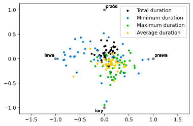
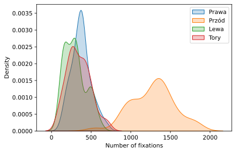

\newpage
# Wstęp

Badanie polega na okulograficznym sprawdzeniu postrzegawczości na trasie kolejowej z perspektywy maszynisty lokomotywy. Dane zostały uzyskane przy pomocy okulografu Tobii Pro.  
Do pomiarów zostały wykorzystane dwa nagrania przedstawiające ruch pociągu po torach kolejowych: rzeczywiste oraz animacja.  
Wśród zgromadzonych danych znajdują się takie pomiary jak czasy fiksacji (ogólny, średni, minimalny i maksymalny) oraz czasy sakad (ogólny, średni, minimalny i maksymalny).  
W danej wizualizacji wykorzystaliśmy dane fiksacji, gdyż wizualizacja sakad przy obrazie dynamicznym nie jest miarodajna.

Badania zostały przeprowadzone na dwóch grupach ludzi: dla nagrania rzeczywistego, składającej się z 43 osób oraz dla animacji, liczącej 41 osób.  
Ponadto, przeprowadziliśmy badania na sobie, wykorzystując nagranie rzeczywiste, co jest przedstawione osobno.

\newpage
# Badania fiksacji

## Statystyki długości fiksacji

{ width=80% }

{ width=80% }

Po wizualizacji danych pierwsze, co się rzuciło w oczy to znaczna różnica w wykresach dla minimalnego czasu fiksacji oraz duża zbieżność wykresów średniego czasu fiksacji dla dwóch nagrań. Ta zbieżność sugeruje bardzo podobny, ogólny schemat postrzegania.

Na wykresie danych z nagrania rzeczywistego widać, że najwięcej krótkich, prawdopodobnie mimowolnych spojrzeń przypada na tory, lecz na analogicznym wykresie dla danych z animacji, ta dysproporcja jest mniej widoczna. To jest najprawdopodobniej spowodowane tym, że badane osoby postrzegały prawdziwe nagranie jako bardziej realne, mimowolnie "wczuwali się w maszynistę".

Widać również fakt, że przy obydwu nagraniach osoby badane najwięcej patrzyły w środkową część obrazu, nad torami.

{ width=80% }

{ width=80% }

Największa widoczna różnica między tymi dwoma wykresami to znacznie mniejszy rozrzut punktowy fiksacji po bokach podczas badania przy użyciu animacji. Osoby badane mniej zwracały uwagę na elementy znajdujące się po lewej i prawej stronie obrazu podczas oglądania animacji niż przy nagraniu rzeczywistym.

\newpage
## Statystyki ilości fiksacji

{ width=90% }

{ width=90% }

Z wykresów przedstawiających funkcję gęstości prawdopodobieństwa dla ilości fiksacji widać, że najczęstsze byy fiksacje w prawej części obrazu, a największa ilość fiksacji natomiast przypada na przód - czyli obszar obrazu nad torami kolejowymi. Jest to zależność, która występuje zarówno w wynikach badań dla nagrania rzeczywistego, jak i animacji.

\newpage
# Badania własne

Badania wspomniane wyżej przeprowadzilismy również z własnym uczęstnictwem. Udało nam się pozyskać dane, na podstawie których stworzyliśmy "heatmapy" dla każdego członka grupy projektowej, oraz zestawiliśmy je w jedną "heatmapę" **Combined**.

{ width=90% }

Przy generowaniu "heatmap" spotkalismy się z problemem, mianowicie punkty, na które się patrzyła osoba badana, czasem znajdowały się poza obszarem ekranu, dlatego też wymagane było obcięcie danych z wartości przekraczających granice wyświetlacza.   
Na "heatmapach" wyraźnie widać punkty kalibracyjne, są one ulokowane dokładnie w tych samych miejscach dla każdego uczęstnika badań. Najczęściej odwiedzanym punktem był jednoznacznie środek obrazu. Przy złożeniu **Combined** widać, że badani patrzyli się na lewą część obrazu minimalnie więcej, niż na prawą, z racji na to, że po lewej stronie znajdowały się wszelakie budynki oraz reklamy, mocno przyciągające uwagę "maszynisty".   
Widać również pewną ciekawą tendencję osób badanych do zdecydowanie bardziej swobodnego rozglądania się w poziomie niż w pionie (górna i dolna część ekranu była dość rzadko odwiedzana).

<!-- pandoc -H format.sty -H disable-float.tex --highlight-style=tango --pdf-engine=xelatex --toc -o readme.pdf readme.md -->
